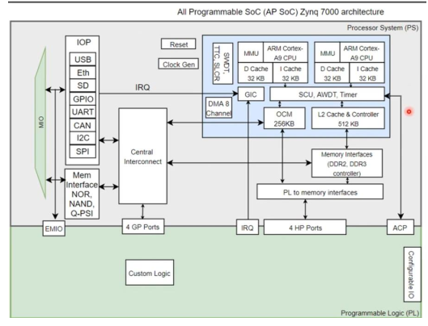

# Reconfigurable System Design: AND/NOT Gate Implementation on ZYNQ FPGA

This project is a hands-on implementation of a simple logic design using a reconfigurable system (ZYNQ7000 on Arty Z7-10 board). The main objective is to demonstrate the interaction between the Programmable Logic (PL) and the Processing System (PS) in a ZYNQ-based SoC using Xilinx Vivado and Vitis tools.

## Project Overview

We implemented a basic hardware logic system:
- A **2-input AND gate** is implemented in the PL (FPGA fabric).
- The output of the AND gate is passed to the PS (ARM Cortex-A9 processor).
- In the PS, a **NOT operation** is performed on the AND result.
- The final output is displayed through an LED.

This demonstrates a mixed hardware/software co-design approach where:
- The PL handles low-level parallel logic.
- The PS performs additional processing using C-code via Vitis.

## Tools & Hardware

- **FPGA Board**: Arty Z7-10 (ZYNQ7000 XC7Z007S)
- **Design Suite**: Xilinx Vivado 2023 + Vitis
- **HDL Language**: VHDL
- **Communication Protocol**: AXI GPIO

## Features

- Demonstrates integration of PL and PS on ZYNQ architecture.
- Uses AXI GPIO interface for communication between hardware and software.
- Real-time interaction through user-controlled inputs and LED outputs.

## Build Steps

1. Create a new Vivado project and choose the Arty Z7-10 board.
2. Implement the AND gate in VHDL and add it to the Block Design in PL.
3. Add AXI GPIO interfaces and configure them for input/output.
4. Connect PL GPIOs to physical pins via a constraints file.
5. Generate the bitstream and export the hardware to Vitis.
6. In Vitis, write C code to read the AND gate output, perform NOT operation, and send it to the LED.
7. Program the FPGA and run the application.

## Result

Upon successful implementation:
- The inputs control the AND gate.
- The output (after NOT operation in PS) is shown on the LED.
- A test message ("We are up") is printed in the UART console to confirm successful setup.

## Author

Shayan Nagizadeh 
Amirkabir University of Technology  
Course: Reconfigurable System Systems  
Instructor: Dr. Sahebzamani
